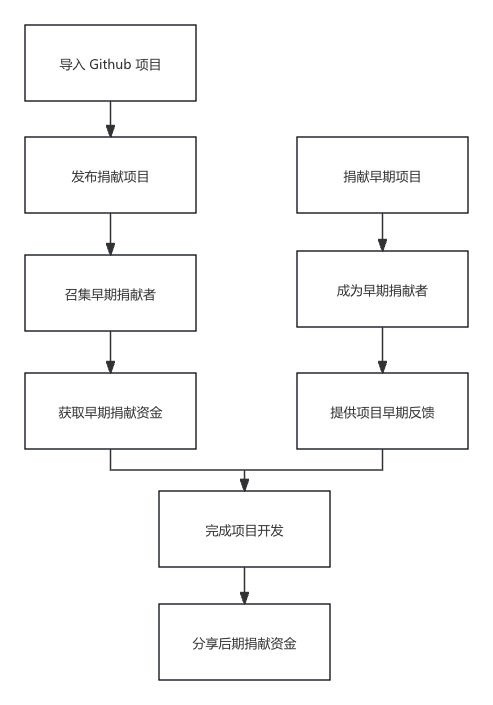

# public-goods-donate

公共物品捐赠平台

[public-goods-donate-contract](https://github.com/33357/public-goods-donate-contract)

[public-goods-donate-web](https://github.com/33357/public-goods-donate-web)

## 问题说明
开源公共物品一直有以下影响发展的问题：

项目创建期：
1. 建设成本开发者独自承担
2. 主体用户没有明确

项目维护期：
1. 难以保护商业权益
2. 收益不能支撑长期维护

## 解决方案
早期捐献者可以帮助解决上面问题。

早期捐献者：在项目创建期捐赠一定金额，帮助项目完成，并分享项目后期收益。
捐献者：只有捐献项目的捐献者才能获得项目商业授权。

早期捐献者的帮助方式

项目建设期：
1. 分担公共项目开发成本
2. 作为早期用户提供反馈

项目维护期：
1. 共同保护项目商业权益
2. 共同进行项目长期维护

## AI 推荐

提高捐献匹配度，使用高相关数据的 AI 推荐系统：
- 项目数据推荐
    1. 推荐同一类型的项目。
    2. 推荐高捐献比例的项目
    3. 推荐同一项目作者的项目。

- 用户行为推荐
    1. 基于用户浏览数据进行推荐。
    2. 推荐与当前用户有相似行为的其他用户喜欢的项目。
    3. 推荐与用户以前互动过的项目相似的其他项目。